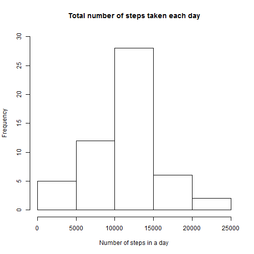
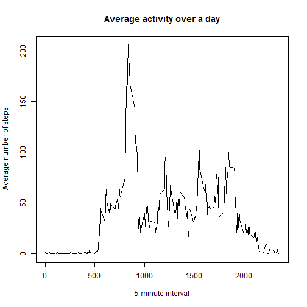
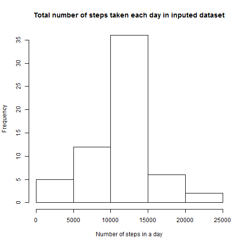
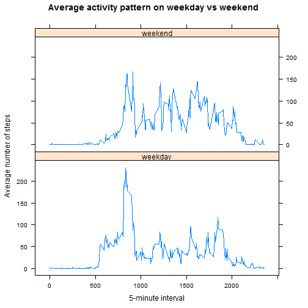

# Reproducible Research: Peer Assessment 1

The interest of this inquiry is the data about personal movement using activity monitoring devices such as a Fitbit, Nike Fuelband, or Jawbone Up. These type of devices are part of the “quantified self” movement – a group of enthusiasts who take measurements about themselves regularly to improve their health, to find patterns in their behavior, or because they are tech geeks. 

We use the data from a personal activity monitoring device. This device collects data at 5 minute intervals through out the day. The data consists of two months of data from an anonymous individual collected during the months of October and November, 2012 and include the number of steps taken in 5 minute intervals each day.

The data has been downloaded from [here](https://d396qusza40orc.cloudfront.net/repdata%2Fdata%2Factivity.zip).

## Loading and preprocessing the data

We set time locale to English, just in case.
If the data is not available in expected location, download it and unzip it. Also, convert the dates to Date format.


```r
Sys.setlocale("LC_TIME", "English")
```

```
## [1] "English_United States.1252"
```

```r
if (!file.exists("activity.csv")) {
    if (!file.exists("activity.zip")) {
        file.download("https://d396qusza40orc.cloudfront.net/repdata%2Fdata%2Factivity.zip", 
            mode = "wb")
    }
    library(utils)
    unzip("activity.zip")
}

activity = read.csv("activity.csv")

activity$date = as.Date(activity$date)
```


## What is mean total number of steps taken per day?

To see the distribution of activity over different days, we create a histogram of the total number of steps taken each day:

```r

summary = with(activity, aggregate(steps ~ date, FUN = sum))

hist(summary$steps, main = "Total number of steps taken each day", xlab = "Number of steps in a day", 
    ylab = "Frequency", ylim = c(0, 30))
```

 


Mean total number of steps taken per day is:

```r
options(digits = 8)
mean(summary$steps)
```

```
## [1] 10766.189
```

Median total number of steps taken per day is:

```r
options(digits = 8)
median(summary$steps)
```

```
## [1] 10765
```


## What is the average daily activity pattern?

In order to see the average daily activity pattern, we create a time series plot of the 5-minute interval (x-axis) and the average number of steps taken, averaged across all days (y-axis):

```r
interval.dat = with(activity, aggregate(steps ~ interval, FUN = mean))
plot(interval.dat$interval, interval.dat$steps, type = "l", main = "Average activity over a day", 
    xlab = "5-minute interval", ylab = "Average number of steps")
```

 


5-minute interval which, on average across all the days in the dataset, contains the maximum number of steps:

```r
most.freq = interval.dat$interval[which.max(interval.dat$steps)]
paste(most.freq%/%60, ":", most.freq%%60, sep = "")
```

```
## [1] "13:55"
```


## Imputing missing values

Total number of missing values is:

```r
missingrows = apply(activity, 1, function(x) {
    any(is.na(x))
})

sum(missingrows)
```

```
## [1] 2304
```


We shall create a new dataset that is equal to the original dataset but with the missing data filled in by using mean of steps in the identical interval over different days. Then we recreate histogram of the total number of steps taken each day with imputed dataset:

```r
activity.imputed = activity

indices = sapply(activity.imputed$interval[missingrows], function(x) {
    which(interval.dat$interval == x, arr.ind = T)
})

activity.imputed$steps[missingrows] = interval.dat$steps[indices]

summary2 = with(activity.imputed, aggregate(steps ~ date, FUN = sum))

hist(summary2$steps, main = "Total number of steps taken each day in inputed dataset", 
    xlab = "Number of steps in a day", ylab = "Frequency")
```

 

Mean total number of steps taken per day in imputed dataset is:

```r
options(digits = 8)
mean(summary2$steps)
```

```
## [1] 10766.189
```

The mean does not differ from previously calculated mean.

Median total number of steps taken per day in imputed dataset is:

```r
options(digits = 8)
median(summary2$steps)
```

```
## [1] 10766.189
```

The median differs just by a little from original data and is in fact identical to the mean.

## Are there differences in activity patterns between weekdays and weekends?
To inspect differences, we create factor variable that shows if the activity is recorded on weekday or on weekend. Then, we create panel plot containing a time series plot of the 5-minute interval (x-axis) and the average number of steps taken, averaged across all weekday days or weekend days (y-axis) to inspect potential differences.

```r

activity.imputed$weekday = factor(weekdays(activity.imputed$date) %in% c("Monday", 
    "Tuesday", "Wednesday", "Thursday", "Friday"), levels = c(T, F), labels = c("weekday", 
    "weekend"))

library(lattice)
summary3 = with(activity.imputed, aggregate(steps ~ interval + weekday, FUN = mean))
xyplot(steps ~ interval | weekday, data = summary3, type = "l", layout = c(1, 
    2), main = "Average activity pattern on weekday vs weekend", ylab = "Average number of steps", 
    xlab = "5-minute interval")
```

 


Obviously there are differences in activity patterns. Weekdays have bigger peak with lower activity after it, while weekend days have more uniform activity during the day and also the activity prolongs longer towards the end of the day. 
